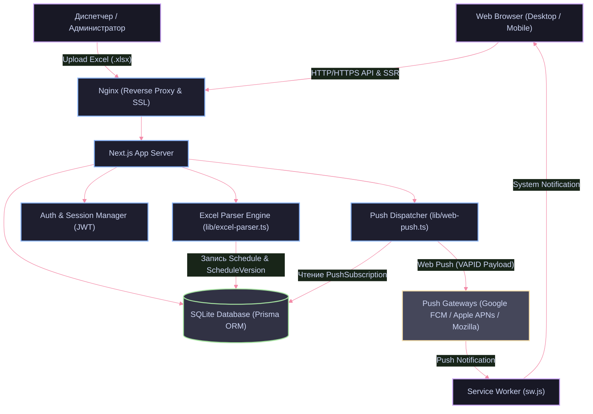

# Электронное расписание КМЭПТ

Веб-платформа автоматизации дистрибуции расписания занятий Колледжа мировой экономики и передовых технологий (КМЭПТ). Сервис доступен в промышленной эксплуатации по адресу: [https://rp.kmept.ru/](https://rp.kmept.ru/).

---

## Навигация по подпроектам

[Frontend →](./frontend/README.md) | [Backend →](./backend/README.md)

---

## Контекст и бизнес-цели

### Проблема процесса до внедрения системы

Формирование расписания в колледже осуществляется в настольной автоматизированной системе «РекторКолледж». До внедрения платформы цепочка публикации требовала непрерывного ручного труда диспетчера:

1. Экспорт сводных данных из «РекторКолледж» в файлы формата Word.
2. Ручная вычитка, корректировка и визуальное оформление расписания отдельно для каждой учебной группы.
3. Экспорт каждого документа в PDF и передача в службу техподдержки ЭИОС для загрузки в закрытые разделы групп на портале.
4. Ручная публикация файлов и текстовых уведомлений об изменениях в разрозненных Telegram-каналах учебных групп.
5. Формирование индивидуальных файлов в Excel для каждого преподавателя и их точечная отправка силами начальника учебного отдела.

Процесс занимал от 3 до 5 часов на каждую публикацию, приводил к рассинхронизации данных, задержкам оповещения студентов и высокой вероятности ошибок человеческого фактора.

### Реализованное решение

Разработана отказоустойчивая full-stack платформа на базе TypeScript, автоматизирующая цикл публикации на 90%:

- Диспетчер загружает исходный Excel-файл выгрузки из «РекторКолледж» в административную панель в один клик.
- Серверный модуль парсинга автоматически десериализует таблицу, валидирует структуру, нормализует наименования аудиторий и разделяет данные на индивидуальные расписания студенческих групп и преподавателей.
- Выделен изолированный учет занятий по физической культуре.
- При сохранении новой версии расписания сервис формирует транзакционную запись и асинхронно рассылает Web Push-уведомления подписчикам соответствующих групп через браузерный Push API.

### Архитектурное разделение и участие в разработке

- Проект спроектирован и реализован студентами 4 курса специальности «Информационные системы и программирование»: Платон Федотов, Владислав Бекасов.
- Научный руководитель: Рядинская Людмила Васильевна.
- Распределение кодовой базы:
  - Backend: 100% ручная разработка с нуля (архитектура моделей данных, устойчивый к смене форматов парсер неструктурированного Excel, модуль Web Push по спецификации RFC 8291/8292, авторизация на базе JWT и bcrypt).
  - Frontend: ~30% кода ускорено с использованием AI-инструментов (Claude Code на базе модели Opus 4.6) для верстки адаптивных страниц, темной неоновой темы и прототипирования интерфейсных компонентов.

---

## Функциональные возможности

- Автоматический парсинг Excel: поддержка старого и нового форматов дат («Пн, » и «Пн, 09.03.26»), объединение подгрупп через слеш (`1. Предмет / 2. Предмет`), отсечение служебных меток `(занятие)`, очистка спецсимволов в номерах аудиторий.
- Индивидуальные расписания групп: структурированное отображение номеров пар, временных слотов, дисциплин, преподавателей и типов аудиторий.
- Расписание для преподавателей: инвертированное представление сетки занятий с поиском по ФИО и детализацией по группам.
- Выделенный блок физической культуры: отдельная обработка и визуализация расписания физкультурных занятий.
- Атомарное версионирование: каждая загрузка фиксируется как отдельная сущность `ScheduleVersion`. Запросы клиентов обслуживаются строго по активной версии без состояния гонки.
- Браузерные Web Push-уведомления: доставка оповещений об обновлениях студентам конкретных групп без необходимости установки сторонних приложений.
- Защищенный административный интерфейс (`/nimda`): управление версиями, мониторинг базы подписчиков, ручная загрузка файлов и просмотр статистики.
- Адаптивный дизайн: оптимизация под мобильные устройства, сохранение выбранной группы и преподавателя в `localStorage`.

---

## Стек технологий

| Слой | Технология | Назначение |
|------|------------|------------|
| Frontend Core | Next.js 16 (App Router), React 19 | Рендеринг компонентов, серверный и клиентский роутинг |
| Styling & UI | Tailwind CSS 4, Lucide React | Компонентные стили, неоновая цветовая схема, векторные иконки |
| Push Client | Service Worker API, Web Push API | Фоновое получение пуш-нотификаций в браузере |
| Backend Runtime | Node.js (Next.js Route Handlers) | Обработка HTTP-запросов, API эндпоинты, middleware |
| Language | TypeScript 5.9 | Статическая типизация всей кодовой базы |
| ORM & Database | Prisma ORM 5.22, SQLite (better-sqlite3) | Схема данных, миграции, транзакционный доступ к БД |
| Parsing Engine | XLSX (SheetJS) | Низкоуровневый разбор бинарных Excel-книг выгрузки |
| Push Service | web-push (VAPID) | Шифрование полезной нагрузки и отправка сообщений в FCM / Mozilla push services |
| Security | jsonwebtoken, bcryptjs | JWT-аутентификация администратора, безопасное хэширование паролей |
| Infrastructure | Docker, Docker Compose, Nginx, Certbot | Контейнеризация standalone-сборки, reverse proxy, SSL/TLS терминация |

---

## Архитектура системы



### Потоки данных платформы

1. Загрузка расписания: Администратор передает `.xlsx` файл через эндпоинт `POST /api/admin/upload`.
2. Валидация и разбор: Модуль парсера валидирует листы, извлекает метаданные групп, преподавателей, номера кабинетов и временные интервалы.
3. Атомарное обновление БД: Создается запись `ScheduleVersion` с флагом `isActive: 1`, деактивируются старые версии, вставляются новые записи `Schedule`.
4. Диспетчеризация нотификаций: Модуль `web-push` выбирает подписчиков обновленных групп из таблицы `PushSubscription`, подписывает payload VAPID-ключами и асинхронно отправляет запросы в шлюзы доставки (FCM, Mozilla, Apple).
5. Клиентское потребление: Браузерный Service Worker перехватывает событие `push` и выводит системное уведомление со ссылкой на страницу группы.

---

## Быстрый старт

### Требования к окружению

- Docker 24+ и Docker Compose v2+
- Node.js 20+ (для локальной разработки без Docker)

### Запуск инфраструктуры в Docker

1. Склонируйте репозиторий:
```bash
git clone https://github.com/skittlesmay/rp.kmept.git
cd rp.kmept
```

2. Сформируйте рабочий файл конфигурации на основе безопасного шаблона:
```bash
cp .env.example .env
```
Заполните обязательные параметры: `JWT_SECRET` (произвольная строка от 32 символов) и VAPID-ключи (при необходимости генерации: `npx web-push generate-vapid-keys`).

3. Запустите контейнеры:
```bash
docker compose up --build -d
```

4. Инициализируйте схему базы данных внутри контейнера:
```bash
docker compose exec kmept-schedule ./node_modules/.bin/prisma db push
```

5. Создайте учетную запись администратора:
```bash
docker compose exec kmept-schedule node scripts/create-admin.cjs admin SecurePassword123 "Главный Администратор"
```

Приложение доступно по адресу `http://localhost:3000`. Административная панель находится по пути `http://localhost:3000/nimda`.

---

## Лицензия и условия использования

Проект разработан для внутреннего использования в Колледже мировой экономики и передовых технологий (КМЭПТ). Все права защищены.
