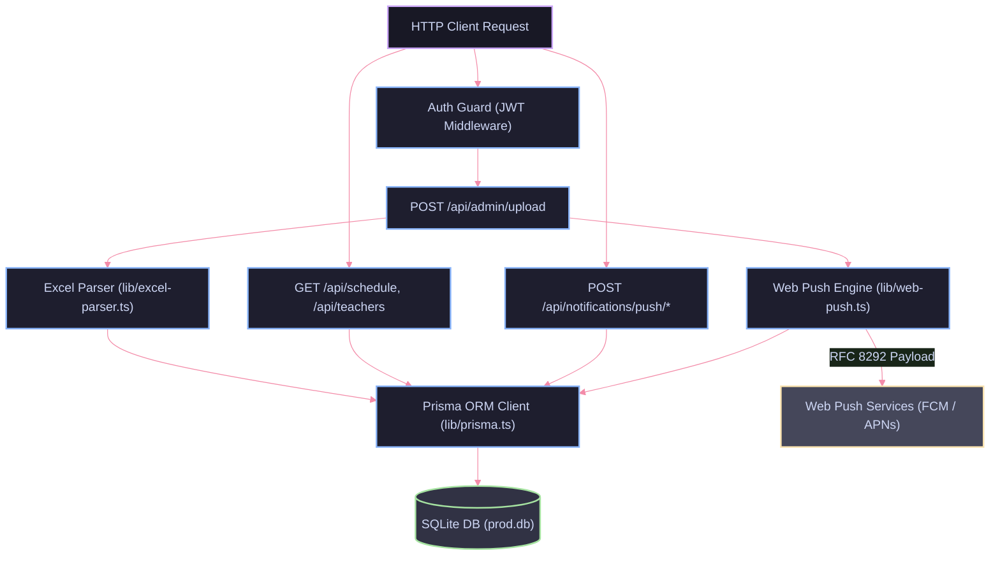

# Backend — Серверная архитектура и API платформы КМЭПТ

Серверная часть платформы реализована на базе Next.js Route Handlers (Node.js runtime) с использованием Prisma ORM, Better-SQLite3 и TypeScript. Бэкенд отвечает за обработку и валидацию бинарных выгрузок Excel из системы «РекторКолледж», атомарное версионирование расписания, криптографическую JWT-аутентификацию и асинхронную рассылку Web Push-уведомлений по стандарту VAPID.

---

## Стек технологий

| Технология | Версия | Назначение |
|------------|--------|------------|
| Node.js / Next.js Route Handlers | 16.1.6 | Среда выполнения, диспетчеризация API-запросов |
| TypeScript | 5.9.3 | Строгая типизация моделей и сервисных слоев |
| Prisma ORM | 5.22.0 | Схема данных, миграции и построитель SQL-запросов |
| Better-SQLite3 | 12.6.2 | Высокопроизводительный драйвер для встраиваемой БД SQLite |
| XLSX (SheetJS) | 0.18.5 | Парсинг и обработка бинарных Excel-таблиц |
| web-push | 3.6.7 | Реализация протокола Web Push (RFC 8291, RFC 8292) |
| jsonwebtoken | 9.0.3 | Формирование и валидация подписанных JWT-токенов сессий |
| bcryptjs | 3.0.3 | Криптографическое хэширование паролей администраторов |

---

## Переменные окружения (.env)

Конфигурация сервера изолирована в переменных окружения. Шаблон доступен в [.env.example](file:///home/skittles/suse_files/Documents/GitHub/forLandingProject/.env.example).

| Переменная | Обязательность | Значение по умолчанию | Описание |
|------------|----------------|-----------------------|----------|
| DATABASE_URL | Да | file:./dev.db | Путь к файлу базы данных SQLite (в Docker: file:/app/data/prod.db) |
| JWT_SECRET | Да | — | Криптографический ключ для подписи токенов администратора (min 32 символа) |
| NEXT_PUBLIC_BASE_URL | Да | http://localhost:3000 | Внешний URL-адрес инстанса (для генерации ссылок в уведомлениях) |
| NEXT_PUBLIC_VAPID_PUBLIC_KEY | Опционально | — | Открытый VAPID-ключ для регистрации push-подписок клиентами |
| VAPID_PRIVATE_KEY | Опционально | — | Закрытый VAPID-ключ для формирования цифровой подписи push-сообщений |
| VAPID_SUBJECT | Опционально | mailto:admin@kmept.ru | Контактный email администратора в заголовке VAPID |

Генерация ключей VAPID:
```bash
npx web-push generate-vapid-keys
```

Генерация JWT-секрета:
```bash
openssl rand -base64 32
```

---

## Архитектура модулей бэкенда



---

## Модели данных (Prisma Schema)

База данных содержит следующие ключевые сущности:

- `Group`: учебные группы (уникальное наименование, связь со связками расписания и подписчиками).
- `Schedule`: единичные записи пар (привязаны к `Group` и `ScheduleVersion`). Хранят день недели (`Пн`-`Сб`), номер пары (1-6), время начала/окончания, дисциплину, преподавателя и аудиторию.
- `ScheduleVersion`: версионирование выгрузок. Содержит метаданные файла, временную метку, идентификатор администратора и флаг активности `isActive`.
- `PushSubscription`: эндпоинты браузерных уведомлений с криптографическими ключами `p256dh` и `auth`, привязанные к `groupId`.
- `Admin`: учетные записи администраторов с хэшированными паролями `bcrypt`.
- `Session`: сессионные маркеры авторизации.
- `PhysicalEducationSchedule`: независимая сетка занятий по физической культуре.

---

## Механизмы ядра

### 1. Отказоустойчивый парсер Excel (`src/lib/excel-parser.ts`)

Парсер ориентирован на нерегулярную структуру таблиц программы «РекторКолледж»:
- Детекция формата даты: автоматическое определение старого (`"Пн, "`) или нового (`"Пн, 09.03.26"`) формата заголовков дней.
- Специфика субботнего расписания: интеграция отдельной сетки звонков для субботы (пары сдвинуты по времени).
- Разделение подгрупп: детекция маркеров вида `1. Предмет / 2. Предмет`, сопоставление с преподавателями и сохранение в каноническом виде.
- Нормализация аудиторий: очистка спецсимволов (`!`, `_`, `-`), приведение названий к единому формату.
- Фильтрация шума: отсечение системных маркеров `(занятие)` и пустых строк.

### 2. Версионирование расписания

Обновление расписания происходит атомарно в рамках транзакции:
1. Загруженный файл парсится в память.
2. В таблице `ScheduleVersion` создается новая запись с `isActive: true`.
3. Предыдущие версии расписания переводятся в `isActive: false`.
4. В таблицу `Schedule` вставляются записи, привязанные к ID новой версии.
5. Клиентские запросы всегда фильтруются по `version.isActive = true`, исключая показ устаревших или поврежденных данных.

### 3. Диспетчер Web Push (`src/lib/web-push.ts`)

- Батчевая отправка: параллельная рассылка подписанным клиентам затронутых групп при загрузке новой версии.
- Самоочистка реестра: при получении ответов `410 Gone` или `404 Not Found` от push-сервиса (Mozilla / Google FCM) недействительная подписка автоматически удаляется из таблицы `PushSubscription`.

---

## Спецификация API-эндпоинтов

### Публичные эндпоинты

| Метод | Путь | Описание |
|-------|------|----------|
| GET | `/api/groups` | Список всех групп, имеющих расписание в активной версии |
| GET | `/api/schedule` | Расписание группы на неделю (`?groupId=...` или `?groupName=...`) |
| GET | `/api/teachers` | Алфавитный список уникальных преподавателей активной версии |
| GET | `/api/teacher-schedule` | Расписание преподавателя с привязкой к группам (`?teacherName=...`) |
| GET | `/api/physical-education` | Расписание занятий физической культуры |
| POST | `/api/notifications/push/subscribe` | Регистрация браузерной push-подписки (`endpoint`, `keys`, `groupId`) |
| POST | `/api/notifications/push/unsubscribe` | Отписка браузера от уведомлений группы |
| POST | `/api/notifications/push/status` | Проверка наличия активной подписки по переданному endpoint |

### Защищенные эндпоинты администратора

Все нижеперечисленные эндпоинты требуют наличия валидного cookie `admin_token` (JWT).

| Метод | Путь | Описание |
|-------|------|----------|
| POST | `/api/admin/auth` | Авторизация администратора (передача `login` и `password`, установка httpOnly cookie) |
| GET | `/api/admin/auth` | Проверка валидности текущей сессии администратора |
| DELETE | `/api/admin/auth` | Завершение сессии и удаление сессионной cookie |
| POST | `/api/admin/upload` | **Ключевой эндпоинт загрузки Excel**. Принимает `multipart/form-data` (`file`), парсит таблицу, создает `ScheduleVersion`, заполняет `Schedule` и триггерит Web Push |
| GET | `/api/admin/versions` | Получение истории всех загруженных версий расписания со статистикой |
| POST | `/api/admin/versions` | Активация выбранной версии расписания (`{ versionId }`) |
| DELETE | `/api/admin/versions` | Удаление версии и всех связанных записей сетки расписания |
| GET | `/api/admin/stats` | Агрегированная статистика: число групп, занятий, активных версий и push-подписчиков |
| POST | `/api/physical-education` | Создание или обновление слота расписания физкультуры |
| DELETE | `/api/physical-education` | Удаление слота расписания физкультуры |

---

## Установка, запуск и миграции БД

### 1. Установка зависимостей
```bash
npm install
```

### 2. Работа со схемой базы данных Prisma
```bash
# Применение схемы Prisma к SQLite без генерации лишних SQL-файлов
npx prisma db push

# Генерация TypeScript-клиента Prisma
npx prisma generate

# Открытие графического веб-интерфейса Prisma Studio для инспекции данных
npx prisma studio
```

### 3. Создание учетной записи первого администратора
```bash
# TypeScript-вариант (через tsx)
npx tsx scripts/create-admin.ts admin Password123 "Имя Администратора"

# CommonJS-вариант (для production-окружения и Docker)
node scripts/create-admin.cjs admin Password123 "Имя Администратора"
```

### 4. Запуск в режиме разработки
```bash
npm run dev
```
Сервер будет запущен на `http://localhost:3000`.
