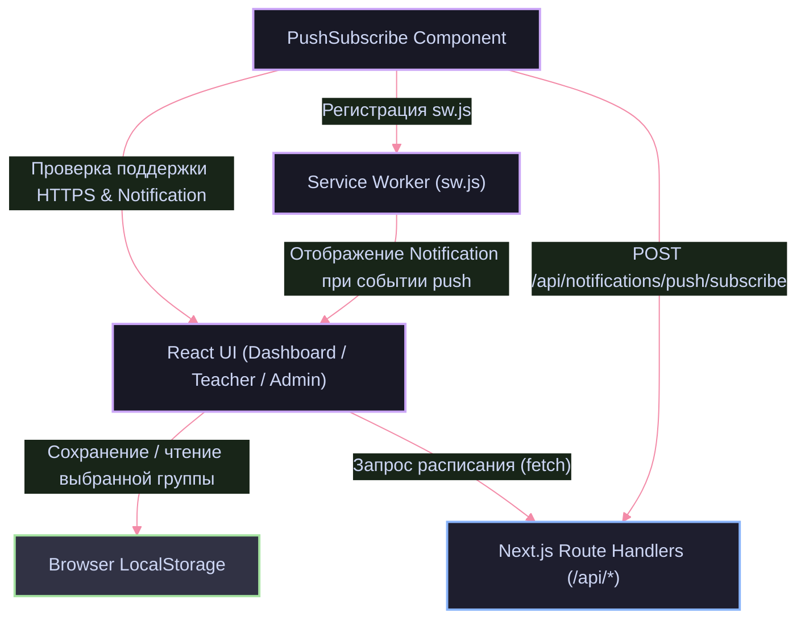

# Frontend — Клиентская часть платформы расписания КМЭПТ

Фронтенд-часть сервиса построена на Next.js 16 (App Router) с использованием React 19 и Tailwind CSS 4. Интерфейс оптимизирован для мобильных устройств, обеспечивает мгновенную загрузку страниц, сохранение пользовательских предпочтений и интеграцию с нативным браузерным Push API.

---

## Стек технологий

| Технология | Версия | Назначение |
|------------|--------|------------|
| Next.js (App Router) | 16.1.6 | Серверный и клиентский роутинг, Server/Client Components |
| React | 19.2.4 | Компонентная модель, декларативное управление UI |
| Tailwind CSS | 4.2.1 | Utility-first стилизация, темная тема, CSS-переменные |
| Lucide React | 0.576.0 | Набор векторных иконок для элементов управления |
| Web Push & Service Worker API | W3C Standard | Фоновое получение push-уведомлений в браузере |

---

## Архитектура страниц и компонентов

```
src/
├── app/
│   ├── page.tsx                  # Главный лендинг платформы
│   ├── layout.tsx                # Корневой лэйаут, подключение шрифтов и стилей
│   ├── globals.css               # Базовые стили и переменные неоновой темы
│   ├── dashboard/
│   │   └── page.tsx              # Расписание студентов (выбор группы, сетка дней)
│   ├── teacher/
│   │   └── page.tsx              # Расписание преподавателей (поиск по ФИО, группы)
│   └── nimda/
│       ├── page.tsx              # Административная панель (загрузка, версионирование)
│       └── login/
│           └── page.tsx          # Форма авторизации администратора
└── components/
    ├── admin/                    # FileUpload, StatsCards, VersionHistory
    ├── layout/                   # Header, Footer, Navigation
    ├── schedule/                 # WeekSchedule, DaySchedule, LessonCard, GroupSelector
    └── ui/                       # Button, Card, Input, Select, PushSubscribe
```

---

## Ключевые архитектурные механизмы

### 1. Маршрутизация и разделение интерфейсов

Используется Next.js App Router с четким разделением ролей:
- Публичный сектор студентов (`/dashboard`): быстрый доступ к расписанию группы, переключение дней недели, карточки пар с детализацией (время, дисциплина, преподаватель, аудитория).
- Публичный сектор преподавателей (`/teacher`): инвертированное представление сетки с поиском преподавателя и отображением групп, у которых проводится занятие.
- Защищенный сектор управления (`/nimda`): изолированный маршрут администратора с проверкой сессионного JWT-токена в cookies, загрузчиком Excel-файлов с индикацией прогресса и списком версий.

### 2. Управление состоянием (State Management)

В приложении используется гибридная модель управления состоянием без избыточных внешних библиотек (Redux/Zustand):
- Локальное состояние экранов: хуки `useState`, `useReducer`, `useMemo` для фильтрации расписания по дням и поиска преподавателей.
- Персистентность выбора: выбранная учебная группа (`selectedGroup`) и преподаватель (`selectedTeacher`) сохраняются в `localStorage`. При повторном визите данные восстанавливаются автоматически.
- Защита от Hydration Mismatch: компоненты, зависящие от браузерного API (`PushSubscribe`, селекторы с `localStorage`), используют двухфазный жизненный цикл с предзагрузочным скелетоном (`status: "loading"`), исключая рассинхронизацию между SSR и клиентским деревом.

### 3. Взаимодействие с API

Сетевой слой стандартизирован. Все клиентские вызовы выполняются через асинхронный `fetch` с типизированными интерфейсами:

```typescript
export interface ApiResponse<T> {
  success: boolean;
  data?: T;
  error?: string;
}
```

- Обработка ошибок: перехват сетевых сбоев, вывод информативных сообщений без падения интерфейса.
- Оптимистичные обновления: обновление статуса подписки в UI до завершения сетевого запроса с откатом при ошибке.

### 4. Service Worker и интеграция Web Push

Модуль подписки (`src/components/ui/PushSubscribe.tsx`) взаимодействует с нативным браузерным Push API:
- Проверка доступности: валидация HTTPS-соединения, поддержки `PushManager` в `window` и текущего уровня разрешений (`Notification.permission`).
- Регистрация Service Worker: регистрация фонового скрипта [public/sw.js](file:///home/skittles/suse_files/Documents/GitHub/forLandingProject/public/sw.js).
- Конвертация VAPID: трансформация публичного ключа `NEXT_PUBLIC_VAPID_PUBLIC_KEY` из формата base64 URL-safe в бинарный `Uint8Array`.
- Синхронизация подписки: отправка эндпоинта и криптографических ключей клиента (`p256dh`, `auth`) на серверный маршрут `/api/notifications/push/subscribe` с привязкой к идентификатору выбранной группы.

---

## Схема взаимодействия клиентских модулей



---

## Локальная разработка и запуск

### Требования

- Node.js 20.x или выше
- Менеджер пакетов npm (или pnpm)

### Инструкция по запуску

1. Установка зависимостей:
```bash
npm install
```

2. Настройка переменных окружения:
Убедитесь, что в корневом файле `.env` указан `NEXT_PUBLIC_BASE_URL` и при необходимости `NEXT_PUBLIC_VAPID_PUBLIC_KEY`.

3. Запуск dev-сервера с горячей перезагрузкой:
```bash
npm run dev
```
Интерфейс будет доступен по адресу `http://localhost:3000`.

4. Сборка production-бандла:
```bash
npm run build
npm run start
```
